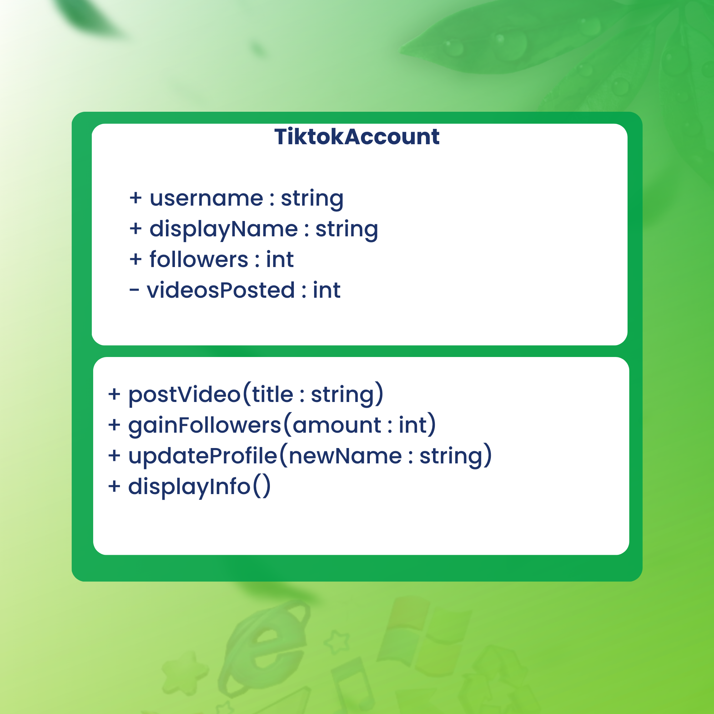
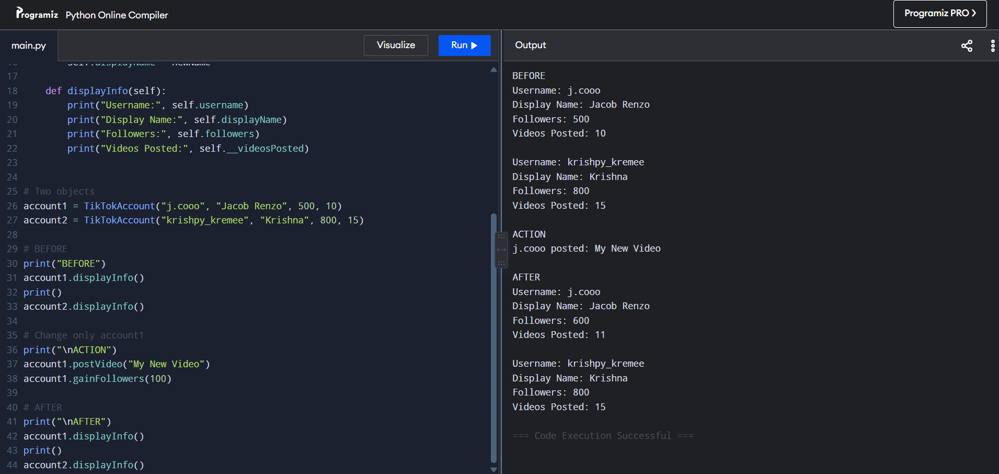
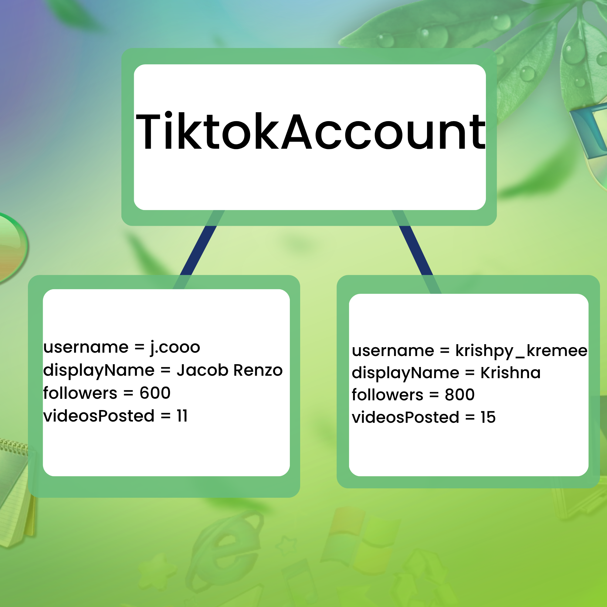

# Class Attributes and Methods
## Previous Design
Link to my previous activity:
[classObjectUML.md](classObjectUML.md)
## Design Revision

Changes from my previous design:

- I kept the TikTokAccount class and its original purpose of representing a user's TikTok account.
- I changed `videosPosted` into a private attribute to protect the number of videos from being changed directly.
- I added the `getVideosPosted()` method so the private `videosPosted` attribute can be accessed safely.
- I also updated the methods so that they can modify and display the account's information.

## Visibility Decisions

| Attribute | Data Type | Visibility | Reason |
|---|---|---|---|
| username | string | Public | The username can be accessed to identify and find the account. |
| displayName | string | Public | The display name can be accessed and updated as part of the user's profile. |
| followers | int | Public | The number of followers can be accessed and changed when the account gains followers. |
| videosPosted | int | Private | The number of videos posted should be protected from being changed directly. It is updated through methods such as `postVideo()`. |

## Updated UML Class Diagram

## Python Implementation

[View Python Source](classImplementation.py)

## Test Run

## Object Diagram

## Analysis

### Why did you make your chosen attribute private?

I made `videosPosted` private because i want the number of videos to be controlled by the class. If other parts of the program could change it directly, they could accidentally give the account an incorrect number of videos. Making it private means that the value can be changed through a method like `postVideo()`. 

### Which method changes the state of your object?

The `postVideo(title)` method change the state of my TikTokAccount object. It increases the private `videosPosted` attribute by 1 whenever a new video is posted. The `gainFollowers(amount)` method also changes the `followers` attribute by adding the specified number of followers.

### How did your two objects demonstrate that instances are independent?

My two objects, `account1` and `account2`, were created from the same TikTokAccount class but had different information. When I used `postVideo()` and `gainFollowers()` on `account1`, only its number of videos and followers changed. The information of `account2` remained the same. 

### What is the difference between your class diagram and your object diagram?

The class diagram shows the TikTokAccount blueprint, including its attributes, data types, visibility, and methods. The object diagram shows the actual objects created from that class and their current values. For example, the class diagram shows `followers : int`, while the object diagram shows an actual value such as `followers = 600`. 