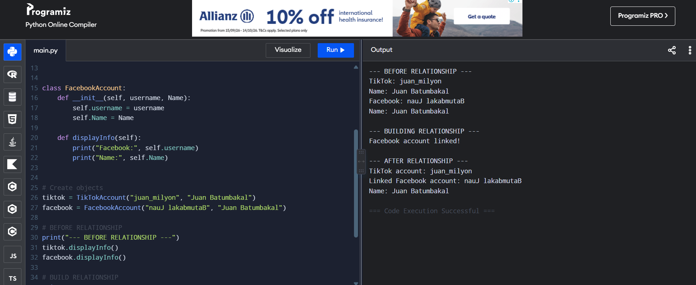

# Class Relationships: Association and Multiplicity
## Previous Work
[Part I - Classes and Objects](classObjectUML.md)
[Part II - Class Attributes and Methods](classAttributesMethods.md)
## Existing Class
Class: TikTokAccount 
Description: The TikTokAccount class represents a user's account on TikTok. It stores basic account information and allows the user to perform actions such as posting videos, gaining followers, and updating their profile. 
## New Related Class
Class:  FacebookAccount
Description:  The FacebookAccount class represents a user's account on Facebook. It stores basic account information and allows the user to perform actions such as posting videos, gaining followers, and updating their profile. 
## Association
Relationship: FacebookAccount is linked to TikTokAccount.
Explanation: The 2 classes are connected because they represent social media accounts belonging to the same user. 
 ## Multiplicity
Multiplicity: One-to-one
Explanation: The multiplicity I chose is one-to-one because one specific TikTok account is linked to one specific Facebook account. Each account is a separate social media profile for the same user.
## UML Class Relationship Diagram

## Python Implementation
[View Python Source](classRelationships.py)
## Test Run

## Object Relationship Diagram

## Analysis
### What is the association between your two classes?
The association between the two classes is that a TikTokAccount is linked to a FacebookAccount. The TikTok account and the Facebook account form a social media connection. It makes the TikTokAccount object able to access information from its connected FacebookAccount object. 
### What multiplicity did you choose and why?  
The multiplicity I chose is one-to-one. because one specific individual Facebook account link can connect directly to exactly one specific TikTok account. They are treated as individual, separate social media profiles for a single user identity rather than grouping multiple accounts together.
### How did you implement the relationship in Python?
I implemented the relationship by adding a facebook_account attribute to the TikTokAccount class. This attribute stores the actual FacebookAccount object instead of only storing its username or display name. I also created a linkFacebook() method that assigns the FacebookAccount object to the attribute. 
### Why did you store an object reference instead of copying its data?
### If your relationship uses many, why is a list appropriate?
